# SoundFind — Semantic Audio Search Engine

SoundFind is a multimodal semantic audio search engine that lets users search an audio library using natural-language descriptions instead of filenames or manually created tags.

For example, the query `dog barking` can retrieve an audio file containing a dog sound even if the filename does not contain the words "dog barking".

The project uses **CLAP** (Contrastive Language-Audio Pretraining) to create text and audio embeddings and **ChromaDB** for vector similarity search. A **Streamlit** interface provides an intuitive search and audio playback experience.

---

## Features

- Natural-language audio search
- Text-to-audio semantic retrieval
- CLAP-based audio and text embeddings
- ChromaDB vector similarity search
- Top-3 matching results
- Audio playback through Streamlit
- Interactive web UI
- SVG-based interface icons
- Reproducible demo dataset
- CPU-compatible setup
- Google Cloud Shell support
- Localhost support

---

## Tech Stack

| Technology | Purpose |
|---|---|
| Python | Core development |
| PyTorch | Deep learning framework |
| Hugging Face Transformers | CLAP model implementation |
| CLAP | Text/audio multimodal embeddings |
| ChromaDB | Vector database |
| Librosa | Audio loading and preprocessing |
| SoundFile | Audio file handling |
| NumPy | Numerical operations |
| Streamlit | Web interface |

---

## How It Works

The system has two main pipelines.

### 1. Audio Indexing

Audio files are converted into CLAP embeddings and stored in ChromaDB.

```
Audio Files
    |
    v
Audio Preprocessing
    |
    v
CLAP Audio Encoder
    |
    v
Audio Embeddings
    |
    v
ChromaDB
    |
    +--> File name
    +--> File path
    +--> Embedding
```

### 2. Semantic Search

A user's text query is converted into a CLAP text embedding and compared with the stored audio embeddings.

```
User Query
    |
    v
CLAP Text Encoder
    |
    v
Text Embedding
    |
    v
ChromaDB Similarity Search
    |
    v
Top 3 Audio Results
    |
    v
Streamlit Audio Playback
```

Because CLAP maps related text and audio representations into a shared embedding space, the system can perform cross-modal retrieval.

---

## Project Structure

```
semantic-audio-search/
├── app.py
├── index_audio.py
├── test_clap.py
├── download_dataset.py
├── requirements.txt
├── README.md
├── .gitignore
│
├── data/
│   └── .gitkeep
│
└── chroma_db/
    └── .gitkeep
```

**`app.py`** — Main Streamlit application. It:
- Loads the CLAP model
- Connects to ChromaDB
- Accepts natural-language queries
- Generates text embeddings
- Searches the vector database
- Displays the top results
- Provides audio playback

**`index_audio.py`** — Creates the ChromaDB vector index. It:
- Reads audio files from `data/`
- Loads audio
- Generates CLAP audio embeddings
- Stores embeddings in ChromaDB
- Stores file metadata

**`test_clap.py`** — Tests whether CLAP is correctly installed and able to generate embeddings from an audio file.

**`download_dataset.py`** — Downloads the small demo dataset into the `data/` directory.

**`requirements.txt`** — Contains the Python dependencies required by the application.

**`data/`** — Contains local audio files. The actual audio files are excluded from GitHub.

**`chroma_db/`** — Contains the locally generated ChromaDB database. The generated database is excluded from GitHub.

---

## Dataset

The prototype uses a small subset of the [ESC-50 environmental sound dataset](https://github.com/karolpiczak/ESC-50).

The demo contains 10 selected categories, including examples such as:

- Dog
- Cat
- Rain
- Thunderstorm
- Clapping
- Laughing
- Keyboard typing
- Footsteps
- Engine
- Sea waves

The project downloads the demo files automatically using:

```bash
python download_dataset.py
```

> **Do not commit the downloaded audio files to GitHub.**

---

## Requirements

Recommended:

- Python 3.10 or Python 3.11
- 8 GB RAM or more
- At least 5 GB free storage
- Internet connection for the initial model and dataset download

A GPU is not required for the demo.

---

## Google Cloud Shell Setup

Google Cloud Shell can be used to run the project without configuring a local Python environment.

### 1. Open Google Cloud Shell

Open Google Cloud Console and start Cloud Shell. Check Python:

```bash
python --version
# or
python3 --version
```

Python 3.10 or 3.11 is recommended.

### 2. Clone the repository

Replace the URL with your GitHub repository URL.

```bash
git clone https://github.com/YOUR_USERNAME/semantic-audio-search.git
cd semantic-audio-search
```

Check the files:

```bash
ls
```

You should see: `app.py`, `index_audio.py`, `test_clap.py`, `download_dataset.py`, `requirements.txt`, `README.md`, `data`, `chroma_db`.

### 3. Check storage

Cloud Shell has limited persistent storage.

```bash
df -h /home
```

If an old virtual environment exists and you do not need it:

```bash
rm -rf venv
```

Clear the pip cache if necessary:

```bash
rm -rf ~/.cache/pip
```

Check again:

```bash
df -h /home
```

### 4. Install CPU PyTorch

For Google Cloud Shell, install the CPU version of PyTorch:

```bash
pip install --no-cache-dir torch --index-url https://download.pytorch.org/whl/cpu
```

Verify:

```bash
python -c "import torch; print(torch.__version__); print('CUDA:', torch.cuda.is_available())"
```

For a CPU Cloud Shell environment, `CUDA: False` is expected.

### 5. Install the remaining dependencies

```bash
pip install --no-cache-dir -r requirements.txt
```

Test the main packages:

```bash
python -c "import transformers; print('Transformers OK')"
python -c "import chromadb; print('ChromaDB OK')"
python -c "import librosa; print('Librosa OK')"
python -c "import streamlit; print('Streamlit OK')"
```

### 6. Download the demo dataset

```bash
python download_dataset.py
```

Check the files:

```bash
ls -lh data
```

You should have approximately 10 audio files.

### 7. Test CLAP

```bash
python test_clap.py
```

The first run may take some time because the model needs to be downloaded. A successful test should show that the CLAP model loaded and an embedding was generated.

### 8. Build the ChromaDB index

```bash
python index_audio.py
```

This processes the audio files and stores their embeddings in ChromaDB. After successful indexing, the `chroma_db/` directory will contain the generated database.

### 9. Start Streamlit

```bash
python -m streamlit run app.py --server.port 8080
```

Then use **Cloud Shell → Web Preview → Port 8080**. The SoundFind application should open in your browser.

### Google Cloud Shell Quick Start

After cloning the repository:

```bash
cd semantic-audio-search
pip install --no-cache-dir torch --index-url https://download.pytorch.org/whl/cpu
pip install --no-cache-dir -r requirements.txt
python download_dataset.py
python test_clap.py
python index_audio.py
python -m streamlit run app.py --server.port 8080
```

Then open Cloud Shell Web Preview on port 8080.

---

## Localhost Setup

SoundFind can also be run locally on Windows, macOS, or Linux.

### 1. Clone the repository

```bash
git clone https://github.com/YOUR_USERNAME/semantic-audio-search.git
cd semantic-audio-search
```

### 2. Create a virtual environment

**Windows**

```bash
python -m venv venv
venv\Scripts\activate
```

**macOS/Linux**

```bash
python3 -m venv venv
source venv/bin/activate
```

### 3. Upgrade pip

```bash
python -m pip install --upgrade pip
```

### 4. Install CPU PyTorch

```bash
pip install torch --index-url https://download.pytorch.org/whl/cpu
```

### 5. Install dependencies

```bash
pip install -r requirements.txt
```

### 6. Download the dataset

```bash
python download_dataset.py
```

Check the dataset:

```powershell
# Windows PowerShell
Get-ChildItem data
```

```bash
# macOS/Linux
ls data
```

### 7. Test CLAP

```bash
python test_clap.py
```

### 8. Build the vector database

```bash
python index_audio.py
```

### 9. Start Streamlit

```bash
python -m streamlit run app.py
```

Open: [http://localhost:8501](http://localhost:8501)

### Localhost Quick Start

```bash
git clone https://github.com/YOUR_USERNAME/semantic-audio-search.git
cd semantic-audio-search

python -m venv venv

# Windows
venv\Scripts\activate

# macOS/Linux
source venv/bin/activate

pip install --upgrade pip
pip install torch --index-url https://download.pytorch.org/whl/cpu
pip install -r requirements.txt

python download_dataset.py
python test_clap.py
python index_audio.py
python -m streamlit run app.py
```

Open: [http://localhost:8501](http://localhost:8501)

---

## Using SoundFind

Once the application is running, enter a natural-language description in the search box.

Example queries:

- `dog barking`
- `heavy rain`
- `people clapping`
- `keyboard typing`
- `someone walking`
- `vehicle engine`
- `sounds of the ocean`
- `cat making a sound`

The application returns the most semantically similar audio files.

### Example Search

Suppose the library contains: `dog.wav`, `rain.wav`, `keyboard.wav`, `footsteps.wav`, `engine.wav`.

The user enters: `dog barking loudly`

The system performs:

```
dog barking loudly
        |
        v
  CLAP Text Encoder
        |
        v
   Text Embedding
        |
        v
      ChromaDB
        |
        v
 Similarity Search
        |
        v
   Top Results
        |
        +--> dog.wav
        +--> footsteps.wav
        +--> other.wav
```

The user can play the returned audio directly from the Streamlit interface.

---

## Adding Your Own Audio

Place your audio files inside `data/`, for example:

```
data/
├── dog_bark.wav
├── rain.wav
├── thunder.wav
├── keyboard.wav
├── footsteps.wav
└── ocean.wav
```

Then rebuild the index and start the application:

```bash
python index_audio.py
python -m streamlit run app.py
```

The new files will be searchable.

### Supported Audio Formats

The indexing script can be configured to work with common formats such as:

- WAV
- MP3
- FLAC
- OGG

WAV is recommended for the prototype.

---

## ChromaDB

ChromaDB stores the audio embeddings locally. After running:

```bash
python index_audio.py
```

the project generates `chroma_db/`.

This directory should not be committed to GitHub because it is generated data. It can be recreated from the audio dataset by running `python index_audio.py`.

### GitHub Storage Strategy

The repository intentionally does not contain the actual audio dataset or generated vector database. The repository contains:

```
data/
└── .gitkeep

chroma_db/
└── .gitkeep
```

The files are recreated using `python download_dataset.py` and `python index_audio.py`. This keeps the GitHub repository lightweight and reproducible.

### Recommended `.gitignore`

```gitignore
data/*.wav
data/*.mp3
data/*.flac
data/*.ogg

chroma_db/

esc50.csv

venv/
.venv/

__pycache__/
*.pyc

.cache/
.pytest_cache/

.env

*.log
```

> Do not commit credentials, API keys, private audio files, or service-account JSON files.

---

## Troubleshooting

**`ModuleNotFoundError: No module named 'torch'`**

```bash
pip install --no-cache-dir torch --index-url https://download.pytorch.org/whl/cpu
```

**`ModuleNotFoundError: No module named 'chromadb'`**

```bash
pip install --no-cache-dir chromadb
```

**`ModuleNotFoundError: No module named 'streamlit'`**

```bash
pip install --no-cache-dir streamlit
```

Then start the application with `python -m streamlit run app.py`.

**`streamlit: command not found`**

Use `python -m streamlit run app.py` instead of `streamlit run app.py`.

**Google Cloud Shell runs out of storage**

```bash
df -h /home
rm -rf ~/.cache/pip
du -h --max-depth=1 ~ 2>/dev/null | sort -h
rm -rf venv   # if an unused virtual environment exists
pip install --no-cache-dir torch --index-url https://download.pytorch.org/whl/cpu   # use CPU PyTorch, not a CUDA build
```

**No audio files found**

```bash
ls data
```

If the directory is empty:

```bash
python download_dataset.py
python index_audio.py
```

**ChromaDB collection does not exist**

Run `python index_audio.py` before starting Streamlit.

**CLAP takes a long time to load**

The first run downloads and initializes the model. Later runs can use the locally cached model.

### Rebuilding the Vector Database

To remove the generated database and rebuild it:

```bash
rm -rf chroma_db
python index_audio.py
```

On Windows PowerShell:

```powershell
Remove-Item -Recurse -Force chroma_db
python index_audio.py
```

---

## Performance

This project is designed as a lightweight proof of concept.

On CPU:

- CLAP inference can take some time.
- Indexing many files is slower than searching.
- Audio embeddings only need to be generated when files are indexed.
- ChromaDB makes repeated similarity searches efficient.

For very large audio libraries, GPU acceleration and batch embedding generation are recommended.

---

## Future Improvements

Potential extensions include:

- Upload audio directly from the Streamlit UI
- Automatically index uploaded files
- Display similarity scores
- Add audio waveform visualization
- Add metadata filtering
- Support thousands or millions of audio files
- Store audio in cloud object storage
- Use a managed vector database
- Add a REST API backend
- Add authentication and multi-user libraries
- Add GPU-based batch embedding generation
- Add hybrid keyword and semantic search

---

## Production Architecture

A scalable version could use:

<p align="center">
  
</p>

The local prototype uses Streamlit and ChromaDB, while the same architecture can later be extended to cloud infrastructure.

---

## Security

Never commit:

- `.env`
- `credentials.json`
- `service-account.json`
- API keys
- Private audio
- Cloud credentials

Add sensitive files to `.gitignore`.

---

## Reproducibility

A new developer can recreate the entire project using:

```
Clone Repository
      |
      v
Install Dependencies
      |
      v
Download Dataset
      |
      v
Test CLAP
      |
      v
Generate Audio Embeddings
      |
      v
Create ChromaDB
      |
      v
Launch Streamlit
      |
      v
Search Audio
```

---

## Key Concepts Demonstrated

This project demonstrates practical experience with:

- Multimodal AI
- Audio embeddings
- Text embeddings
- Contrastive learning
- Cross-modal retrieval
- Semantic search
- Vector databases
- Similarity search
- PyTorch
- Hugging Face Transformers
- CLAP
- ChromaDB
- Librosa
- Streamlit
- Python application development

---

## Resume Description

**Detailed:**
SoundFind — Semantic Audio Search Engine: Built a multimodal audio retrieval system using LAION CLAP to map text and audio into a shared embedding space, with ChromaDB for vector similarity search and Streamlit for an interactive natural-language search interface.

**Short:**
Developed a CLAP-powered semantic audio search engine using text-to-audio embeddings, ChromaDB vector search, and Streamlit.

---

## Author

**Anushka Peruvel**
B.Tech — Artificial Intelligence & Data Science

---

## License

This project is intended for educational, research, and portfolio purposes.

Refer to the original [ESC-50 dataset](https://github.com/karolpiczak/ESC-50) licensing terms before redistributing the dataset or its audio files.
